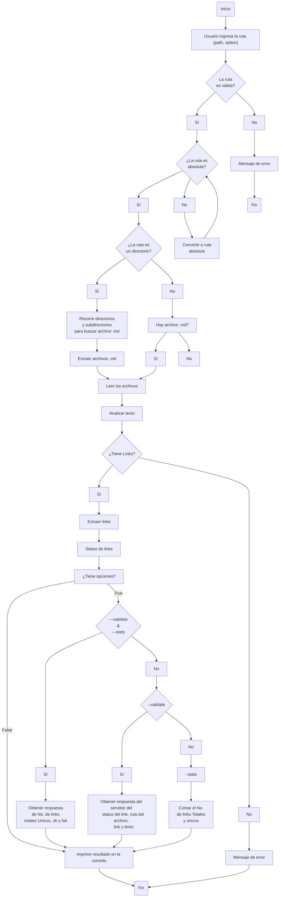

```mermaid
graph TD;
  INICIO(Inicio) --> insertRoute["Usuario ingresa la ruta (path, option)"];
  insertRoute --> A{"La ruta 
  es válida?"};
  A --> B[Sí];
  A --> C[No];
  B --> D{"¿La ruta es 
  absoluta?"};
  C --> E["Mensaje de error"];
  D --> F[Sí];
  D --> G[No];
  G --> KK["Convertir a ruta 
  absoluta"] --> D;
  E --> FIN(Fin);
  F --> H{"¿La ruta es 
  un directorio?"};
  H --> I[Sí];
  H --> J[No];
  I --> K["Recorre directorios
   y subdirectorios
    para buscar archivo .md"]
  K --> L["Extraer archivos .md"] --> P
  J --> M[Hay archivo .md?];
  M --> N["Sí"];
  M --> O["No"];
  N --> P["Leer los archivos"];
  P --> Q["Analizar texto"]
  Q --> R{"¿Tiene Links?"};
  R --> S["Sí"];
  R --> T["No"];
  T --> U["Mensaje de error"]; 
  U --> VFIN(Fin);
  S --> W["Extraer links"];   
  W --> X["Status de links"];
  X --> Y{"¿Tiene opciones?"} -->|False| Z["Imprimir resultado en la consola"] --> VFIN(Fin) ;  
  Y["¿Tiene opciones?"] -->|True| AA{"---validate 
  &
   ---stats"} ;  
  AA --> BB["Sí"];
  AA --> CC["No"];
  BB --> DD["Obtener respuesta
  de No. de links 
  totales Unicos, ok y fail"] --> Z;
  CC --> EE{"--validate"}; 
  EE --> FF["Sí"];
  FF --> GG["Obtener respuesta del servidor del 
   status del link, ruta del archivo, 
   link y texto"]  --> Z
  EE --> HH["No"];
  HH --> II["--stats"];
  II --> JJ["Contar el No. 
  de links Totales 
  y únicos"] --> Z
  


```